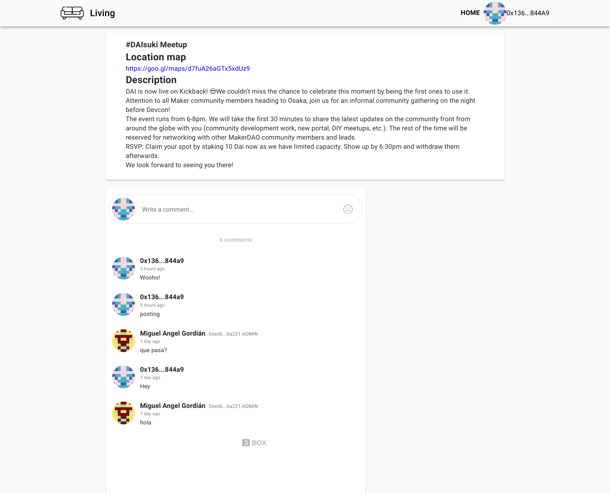

# living
Living room for contract events

DEMO:  https://www.loom.com/share/c5dadd61de6b46bebb7e3ba62be9afb6


## Instructions

### Setup
1. Setup web3 to retrieve 3box thread and profiles
    ```javascript
    const web3 = new Web3(window.web3.currentProvider || 'https://mainnet.infura.io/v3/f1c6706dd83740aba51f22b053cb6759');
    setWeb3(web3);
    ```

2. Set the network and the space name. The posts and comments will depend on this configurations
   due such elements reside on given space and network
   ```javascript
    const molochContractAddress = MolochAddress["0"]
    const deployerContractAddress = DeployerAddress[0];
    const name = 'local/living';
   ```
   
3. Get the configurations to interact with the given events provider
   Here the contracts, connections and mappers are populated
   ```
    {
      mainContract: Emitter of the events,
      eventContract: Allows us to know the admin, if the user is member and details,
      searchEvent:  Configure the event to query on the `mainContract` like 'NewParty',
      isMember: Configure the method name to check if the user is member like 'isRegistered',
      spaceName: Configure where the chats will be stored,
      populate: Allow structure event into required structure and add additional info,
      memberPredicate: Allow customize the isMember in case the output of `isMember` call isn't a boolean type
    }
   ```
   The expected strctured produced by populate is the following:
   ```javascript
    {
       'address': Identify the address of the contract,
       'data': {
         address: Identify the event,
         id: Identify the event,
         admin: Indicate who needs to create the chat for each event,
    
         // Only required in this demo
         name,
         description,
       }
    }
    ```
   
   This lib comes with Moloch and Kickback configurators 
   ```
    const configurator = initMoloch(web3, molochContractAddress, name);
    // const configurator = initWearerKickback(web3, deployerContractAddress, name);
    setConfig(configurator);
   ```

### Retrive events
Based on previous configurations, retrieve the parties or proposals

```javascript
const events = await getEvents(configurator, 4);
```
### Join chat
1. Wire the event contract to allow query is the user is memeber, can post or exists the thread.
    ```javascript
    const EventContract = config.eventContract(data.address)
    const addresses = await window.ethereum.enable();
    const currentUserAddr = addresses[0];
   
2. Allow the sdk decide if the user can join or not the chat
    ```javascript
    const thread = await joinThread(EventContract, currentUserAddr, data.address, space, data.admin, config);
    ```
   
If the thread is different of null means the user is member and the admin has joined the thread
and joined the thread previously.   
To create the thread the admin needs to join the space created previously and optional join the thread.
This is required to avoid give access to users that doesn't allow the space.

### List users on the chats   
With the thread is posible retrieve all users address that commented in this thread.
```javascript
const address = await getUniqueAddress(thread);
```


### Custom comments component

This repo include a 3box comment custom component that allows
validate if the user can post to the thread, just wire the component to
previous configuration.

```javascript
  <ThreeBoxComments
    // Required
    spaceName={config.spaceName}
    threadName={thread.address}
    adminEthAddr={thread.admin}
    firstModerator={thread.admin}
    space={space}

    // Required props for context A) & B)
    box={box}
    currentUserAddr={address}
    canPost={() => this.state.canPost}

    // optional
    members={false}
    showCommentCount={10}
    useHovers={false}
    currentUser3BoxProfile={profile}
    userProfileURL={address => `https://mywebsite.com/user/${address}`}
  />
```


